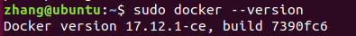
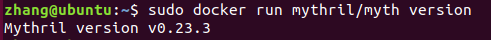
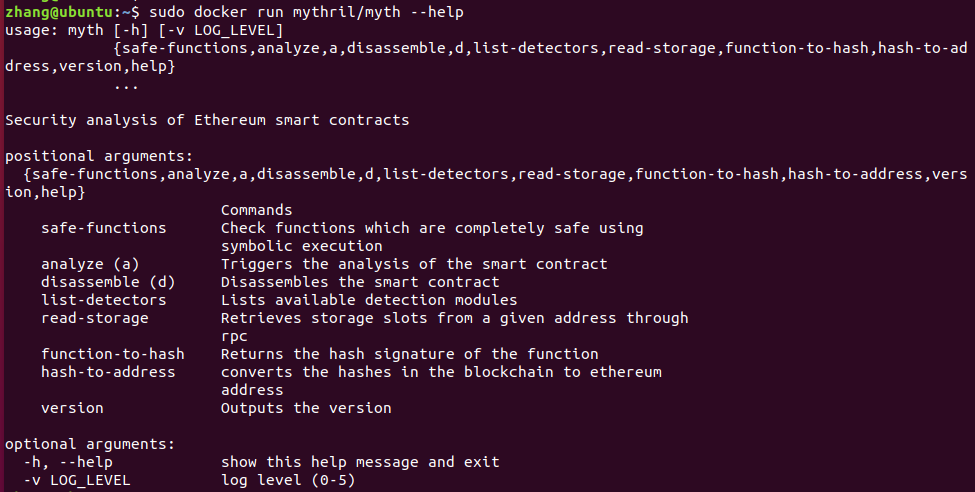

# 以太坊智能合约安全分析工具：Mythril工具使用指南

Mythril 是一个免费的以太坊智能合约的安全分析工具。Mythril 能检测以太坊和其他兼容 EVM 的区块链构建的智能合约的安全漏洞，包括整数溢出、时间戳依赖、重入攻击等。注意，Mythril 的目标是找到常见的漏洞，而不能发现应用程序的业务逻辑问题。因此，如果你要对一个商用系统中的智能合约进行安全分析，建议使用成熟的商用化的安全审计产品，如 MythX、Certik、ChainSulting、OpenZeppelin 等。当然，这些产品不是免费的。

## 环境搭建

目前，Mythril 支持 MacOS 和 Ubuntu，不支持 Windows。

首先安装 Mythril 的运行环境。我们的操作系统环境是 Ubuntu（版本18.0.4），它是安装在 Windows 10 系统虚拟机 VMware 环境下的 Linux 系统。安装 Mythril 有PyPI 库安装和 Docker 安装两种方式，本课程我们以 Docker 安装方式为例来详细介绍 Mythril 工具的安装。

### Docker 安装

所有的 Mythril 版本，从 v0.18.3 开始，都以 mythril/myth 的名称作为 Docker images 发布到 Docker Hub。

#### 安装 Docker

如果你的系统上已安装了 Docker，请忽略。否则，通过下面的命令安装 Docker：

```
$ sudo apt-get install docker.io
```

安装完成后，通过下面的命令查看版本：

```
$ sudo docker version
```

如果安装成功，上面的命令会输出 Docker 的版本号，如下图：



#### 安装 Docker 镜像

通过下面的命令安装最新版本的 Mythril：

```
$ sudo docker pull mythril/myth
```

安装完成后，通过下面的命令查看版本：

```
$ sudo docker run mythril/myth version
```

如果安装成功，上面的命令会输出 Mythril 的版本号，如下图：



#### Mythril 用法

通过下面的命令查看 Mythril 的帮助：

```
$ sudo docker run mythril/myth --help
```

Mythril 的帮助输出如下图：



通过下面的命令对合约源代码进行安全分析：

```
$ sudo docker run -v $(pwd):/tmp mythril/myth analyze /tmp/contract.sol
```

## 安全分析

### 用于分析的合约源码

下面是一个用于安全分析的智能合约源码，这个合约类似于一个抽奖系统，其逻辑是：（1）玩家向合约发送 1 个以太币；（2）合约进行逻辑判断，在同一个区块中对区块时间戳除以 15 取模，当结果为零时，向玩家发送合约中剩余的以太币作为奖励。

```
// SPDX-License-Identifier: MIT
pragma solidity >=0.4.22;

contract Roulette {
    uint public pastBlockTime;
 
    // initially contract
    constructor() {}

    // receive function
    receive() external payable {}

    // fallback function used to make a bet
    fallback() external payable {
        require(msg.value == 1 ether); // must send 1 ether to play
        require(block.timestamp != pastBlockTime);  // only 1 transaction per block
        pastBlockTime = block.timestamp;
        if(block.timestamp % 15 == 0) { // winner
            payable(msg.sender).transfer(address(this).balance);
        }
    }
}
```

以上这个智能合约有一个时间戳依赖漏洞。时间戳依赖是指智能合约的执行依赖于当前区块的时间戳，如果时间戳不同，那么合约的执行结果也有差别。智能合约中取得时间戳只能依赖某个节点（矿工）来做到。这就是说，合约中取得的时间戳是可以由运行其代码的节点（矿工）决定的。理论上，这个时间是可以由矿工控制的。因此，如果在智能合约中不正确地使用区块时间戳，这将是非常危险的。

### 安全分析过程

接下来，让我们观察 Mythril 工具对这个合约的检测与分析结果。

首先，我们把这个合约文件发送到 Ubuntu 主机的 "/tmp" 目录。

然后，通过以下命令来对合约源码执行检测分析：

```
$ docker run -v $(pwd):/tmp mythril/myth analyze /tmp/Roulette.sol
```

耐心等待几分钟后（这个执行时间取决于主机的配置），我们看到检测结果如下：

```
==== Dependence on predictable environment variable ====
SWC ID: 116
Severity: Low
Contract: Roulette
Function name: fallback
PC address: 70
Estimated Gas Usage: 889 - 984
A control flow decision is made based on The block.timestamp environment variable.
The block.timestamp environment variable is used to determine a control flow decision. Note that the values of variables like coinbase, gaslimit, block number and timestamp are predictable and can be manipulated by a malicious miner. Also keep in mind that attackers know hashes of earlier blocks. Don't use any of those environment variables as sources of randomness and be aware that use of these variables introduces a certain level of trust into miners.
--------------------
In file: /tmp/Roulette.sol:16

require(block.timestamp != pastBlockTime)

--------------------
Initial State:

Account: [CREATOR], balance: 0x2001000100000301, nonce:0, storage:{}
Account: [ATTACKER], balance: 0x0, nonce:0, storage:{}

Transaction Sequence:

Caller: [CREATOR], calldata: , value: 0x0
Caller: [SOMEGUY], function: unknown, txdata: 0x00, value: 0xde0b6b3a7640000

==== Dependence on predictable environment variable ====
SWC ID: 116
Severity: Low
Contract: Roulette
Function name: fallback
PC address: 102
Estimated Gas Usage: 6105 - 26200
A control flow decision is made based on The block.timestamp environment variable.
The block.timestamp environment variable is used to determine a control flow decision. Note that the values of variables like coinbase, gaslimit, block number and timestamp are predictable and can be manipulated by a malicious miner. Also keep in mind that attackers know hashes of earlier blocks. Don't use any of those environment variables as sources of randomness and be aware that use of these variables introduces a certain level of trust into miners.
--------------------
In file: /tmp/Roulette.sol:18

if(block.timestamp % 15 == 0) { // winner
            payable(msg.sender).transfer(address(this).balance);
        }

--------------------
Initial State:

Account: [CREATOR], balance: 0x400, nonce:0, storage:{}
Account: [ATTACKER], balance: 0x0, nonce:0, storage:{}

Transaction Sequence:

Caller: [CREATOR], calldata: , value: 0x0
Caller: [SOMEGUY], function: unknown, txdata: 0x00, value: 0xde0b6b3a7640000

==== Unprotected Ether Withdrawal ====
SWC ID: 105
Severity: High
Contract: Roulette
Function name: fallback
PC address: 150
Estimated Gas Usage: 6947 - 61228
Any sender can withdraw Ether from the contract account.
Arbitrary senders other than the contract creator can profitably extract Ether from the contract account. Verify the business logic carefully and make sure that appropriate security controls are in place to prevent unexpected loss of funds.
--------------------
In file: /tmp/Roulette.sol:19

payable(msg.sender).transfer(address(this).balance)

--------------------
Initial State:

Account: [CREATOR], balance: 0x0, nonce:0, storage:{}
Account: [ATTACKER], balance: 0x826008e004f4e002, nonce:0, storage:{}

Transaction Sequence:

Caller: [CREATOR], calldata: , value: 0x0
Caller: [SOMEGUY], function: unknown, txdata: 0x, value: 0x1
Caller: [ATTACKER], function: unknown, txdata: 0x01020801, value: 0xde0b6b3a7640000
```

通过以上的检测分析结果，我们可以看到，Mythril 工具确实检测出了合约中的漏洞。这个合约代码共有三个安全问题，其中两个是时间戳依赖漏洞，一个是不受保护的以太币提款漏洞。

**第一个安全漏洞**

漏洞名称：依赖于可预测的环境变量（时间戳依赖）

SWC ID: 116 —— 表示该漏洞的分类编号

Severity: Low  —— 表示该漏洞的严重性程度

Contract: Roulette —— 表示检测的合约名称

Function name: fallback —— 表示发现漏洞的函数名称

PC address: 70 —— 表示程序计数器地址，Program Counter 的简称

Estimated Gas Usage: 889 - 984 —— 表示估算的 Gas 费用开销

漏洞描述——控制流的决定是基于区块的时间戳环境变量。block.timestamp 环境变量用于确定控制流决策。请注意，coinbase、gaslimit、block number 和 timestramp 等变量的值是可预测的，可以被恶意矿工操纵。还要记住，攻击者知道早期块的哈希值。请注意，不要使用任何这些环境变量作为随机性的来源，并且确保使用的这些变量对矿工是可信任的。

再接下来是漏洞代码在合约代码中的行号，并给出了代码段，以及合约的初始状态和交易序列。

**第二个安全漏洞**

漏洞名称：依赖与可预测的环境变量（时间戳依赖）

SWC ID: 116

Severity: Low

Contract: Roulette

Function name: fallback

PC address: 102

Estimated Gas Usage: 6105 - 26200

漏洞描述与第一个漏洞相同，均属于时间戳依赖的安全问题。

**第三个安全漏洞**

漏洞名称：不受保护的以太币提款

SWC ID: 105

Severity: High

Contract: Roulette

Function name: fallback

PC address: 150

Estimated Gas Usage: 6947 - 61228

漏洞描述：任何发送者都可以从合约账户中提取以太币。合约创建者以外的任意发送者可以从合约账户中提取以太币。仔细验证业务逻辑，并确保适当的安全控制以防止意外的资金损失。

**漏洞分类（SWC ID）详见 [智能合约缺陷分类和测试用例](https://swcregistry.io/)**

#### 输出格式

缺省情况下，分析结果以文本形式打印到终端。你可以用 -o 参数改变输出格式:

```
$ sudo docker run -v $(pwd):/tmp mythril/myth analyze /tmp/Roulette.sol -o jsonv2
```

可用的格式有 text、markdown、json 和 jsonv2。对于与其他工具的集成，通常首选 jsonv2 而不是 json，因为它与其他 MythX 工具保持一致。

## 课程小结

**本课程介绍了 Mythril 智能合约安全分析工具的运行环境安装及检测命令，并通过一个合约实例演示了该安全分析工具对 Solidity 合约源代码的检测分析结果。除了对合约源代码进行检测分析， Mythril 工具也支持通过合约地址的智能合约安全检测分析。**

